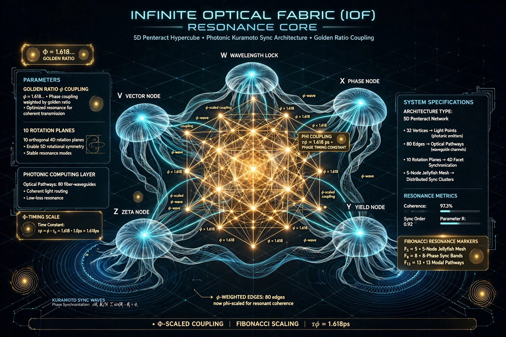

# IOF Resonance Core

**Infinite Optical Fabric (IOF)** is a high-dimensional resonance research platform. It brings together runnable software models, interactive visualizations, and technical notes for people exploring resonance, topology, and proposed photonic-computing architectures.

This repository is for developers, researchers, and curious builders who want to inspect or extend IOF's software layer: topographic-ascent control-policy prototypes, browser visualizations, and supporting design material. Start with the bounded Python check, then open a local visualization.

> “The architecture is identical. The scale is the only variable.” — **Gregory Scott Davis**

## Quick start

The checked Python path needs **Python 3.10+** and Bash; it uses only the standard library for the v3 engine.

```bash
git clone https://github.com/Immaculate1022/IOF-Resonance-Core.git
cd IOF-Resonance-Core
bash scripts/smoke_all.sh
```

The script runs deterministic unit tests for the v3 engine, a short seeded-engine smoke run, and presence checks for the shared schema and JSX component. For the longer command-line example:

```bash
python3 topological_ascent_engine_v3.py
```

### Try a browser visualization

Open one of these files locally in a browser, or serve the repository with a static file server:

| File | What it provides |
| :--- | :--- |
| [`ForensicTelemetry_Standalone.html`](ForensicTelemetry_Standalone.html) | A local telemetry interface with simulated values, session-local storage, and no server interaction. |
| [`UnityProtocol_Visualizer.html`](UnityProtocol_Visualizer.html) | An interactive Unity/Coexistence protocol visualization. |
| [`index.html`](index.html) | The URP-v1 Soul Terminal interface. |

Some standalone pages load presentation libraries or fonts from CDNs, so network access can affect their full appearance. The GitHub Pages workflow stages the static HTML files, but the documented Pages URLs returned 404 on 2026-09-12. Until a deployment is independently rechecked, local files are the supported way to try the visuals.

## Status and limitations

**This is a research and prototyping repository, not a validated photonic-computing system or production controller.** The Python engines model synthetic, bounded landscapes. Their `Q`, resonance, thermal-risk, and decision values are software-model signals, not hardware measurements or performance results. The standalone telemetry interface also generates simulated values and stores its data locally.

The repository separates conceptual/cosmological framing, proposed engineering targets, and runnable software models. The cosmological mapping is a design metaphor and research heuristic with open predictions; it is not an observational result or validation of a physical implementation. The smoke script checks a limited v3 Python path only. It does not establish physical-device behavior, deployment security, full React parity, or production readiness.

## Software starting points

| Area | Starting point | Description |
| :--- | :--- | :--- |
| **Topographic ascent** | [`topological_ascent_engine_v3.py`](topological_ascent_engine_v3.py) | A Python model of a bounded, multi-peak quality landscape with a memory bank and decisions such as `ASCENT`, `RECALL`, `SHUNT`, `STABILIZE`, and `HOLD`. It exposes `inject_external` and `emit_state` hooks. |
| **React visualization** | [`TopographicPeakAscent.jsx`](TopographicPeakAscent.jsx) | A React 18+ component with a topographic display, bounded memory, peak detection, and an ascent reasoner. It needs a React CDN or bundler harness. |
| **IOF v3 browser core** | [`IOFv3_Core.js`](IOFv3_Core.js) | A modular `FluxEngine`, normalized F/L/U/X state axes, a change buffer, subscriptions, and an optional React component factory. |
| **Earlier Python engine** | [`topological_ascent_engine_v2.py`](topological_ascent_engine_v2.py) | The prior engine with an injectable monotonic clock, explicit phase frequency, clamped external blend weights, and finite-input validation. |
| **Shared contract** | [`schema/ascent_decision.schema.json`](schema/ascent_decision.schema.json) | The decision-object schema used to describe topographic-ascent outputs. |
| **Experimental model patcher** | [`moebius_llama_setup.py`](moebius_llama_setup.py) | A Möbius-Llama layer-replacement experiment that requires PyTorch and Transformers. |

The earlier [`TopographicPeakAscent.legacy.jsx`](TopographicPeakAscent.legacy.jsx) is retained for comparison.

## Further reading

- [Unified IOF Overview](docs/Unified_IOF_Overview.md) explains the relationship between the conceptual, engineering, and software layers.
- [IOF v2 Associative Resonance Research Note](docs/IOF_V2_Associative_Resonance_Research_Note.md) separates hypotheses, baselines, metrics, and hardware-escalation gates.
- [Cosmological Bridge](docs/CosmologicalBridge.md) presents the conceptual mapping and its stated research questions.
- [Topological Optimization Logic](docs/TopologicalOptimizationLogic.md) describes the self-healing and state-reversion framing.
- [Ecosystem Summary](docs/EcosystemSummary.md) provides a wider PegaConstellation overview ([PDF](docs/PegaConstellation_EcosystemSummary.pdf)).

## Related projects

The project documentation identifies these repositories as related work in the wider PegaConstellation context:

- [AHR-Endpoint](https://github.com/Immaculate1022/AHR-Endpoint)
- [IOF-Resonant-Hardware](https://github.com/Immaculate1022/IOF-Resonant-Hardware)

## Contributing and security

Contributions are welcome when they are focused, reproducible, and clear about their assumptions and limitations. Please read [CONTRIBUTING.md](CONTRIBUTING.md), search existing issues, and open an issue before beginning material changes. Suspected vulnerabilities should follow the private-reporting guidance in [SECURITY.md](SECURITY.md), not be disclosed in a public issue.

## License

This repository is released under the [IOF Attribution License v1.0](LICENSE), copyright © 2026 Gregory Scott Davis. The license permits use, copying, modification, publication, distribution, sublicensing, and deployment for any purpose. Any public use, derivative work, or implementation must include clear attribution to **“Infinite Optical Fabric by Gregory Scott Davis, Princeton, NC.”** The material is provided **“AS IS”**, without warranty.

## Concept diagram



*Figure: conceptual visualization of the IOF Resonance Core, including the proposed 5D penteract network, photonic pathways, φ-weighted coupling, rotation planes, and resonance markers. This is an architecture illustration, not a measured hardware schematic, simulation result, or production-performance claim.*

The diagram is a communication aid for the repository’s research direction. Treat its numerical labels as design parameters or conceptual annotations unless a linked experiment supplies definitions, units, methods, raw outputs, and reproducible results.

**IOF Resonance v1.0 · Gregory Scott Davis**
*Infinite Optical Fabric*
